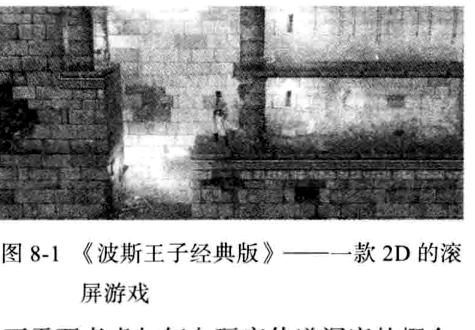
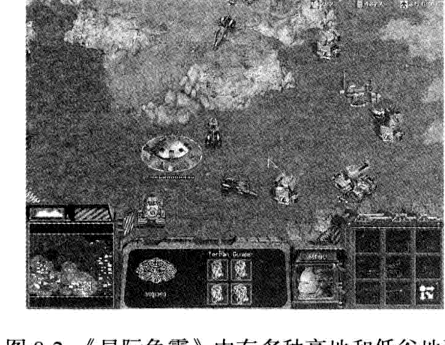
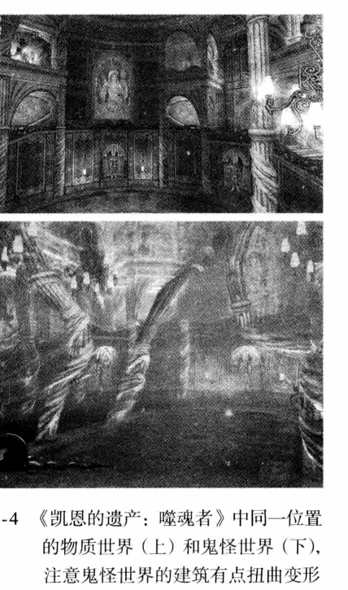
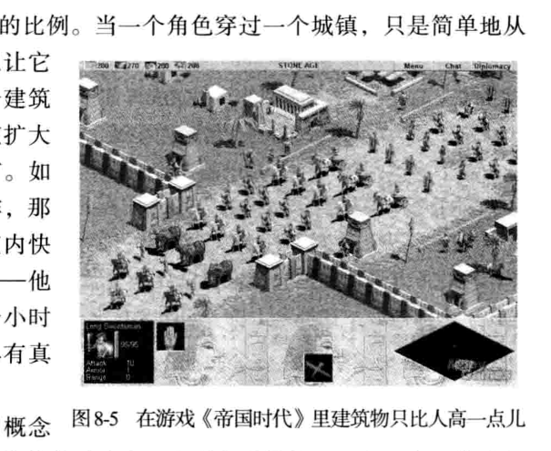

<!-- chapter-pager:start -->

<a class="chapter-pager__button chapter-pager__button--prev" href="..">上一页</a>
<a class="chapter-pager__button chapter-pager__button--next" href="../08-03-02-time-dimension">下一页</a>

<!-- chapter-pager:end -->

# 8.3.1 物理维度

> 来源：私人资料库 OCR 整理，摘自《游戏设计基础（原书第 3 版）》第 8 章。PDF 为扫描版，文字已做轻度校正，仍建议以后逐段人工复核。  
> 关键词：物理维度、时间维度、环境维度、感情维度、道德维度

## 原书内容整理

电子游戏世界几乎都是由某种模拟物理空间来实现的。玩家在空间里移动他的角色，或者操作里面的其他部分或角色。空间的物理性质在很大程度上决定了游戏可玩性。游戏的物理维度通过三个不同的属性来刻画：空间维度、规模以及界限。

#### 1. 空间维度

首先要问自己一个问题，你的游戏中的物理空间是几维空间。你必须明白：游戏物理空间的维度不像游戏显示空间（游戏视角）那样简单，也不同于用软件来实现这个空间。怎样实现和显示空间是两个独立但又互相联系的问题。前者和技术设计有关系，后者和用户界面设计有关系。最后，所有的空间都必须显示在二维的显示器屏幕上，除非你设计的是一款非现实类的游戏，或者显示在3D虚拟现实类游戏设备上，就像Oculus Rift这种。下面是电子游戏典型的维度模式：

- **2D**：多亏了有手机和平板移动设备，世界上大多数的游戏仍旧是二维模式。这种模式在 2D 滚屏游戏里很引人注意，就像《波斯王子经典版》（如图8-1所示）。游戏中的王子可以横冲直撞、上下跳，但是不能向玩家方向移动（出屏幕方向），或者向玩家反方向移动（进屏幕方向）。当你考虑如何显示时，二维世界有一个很大的优势：二维世界直接对应显示器屏幕的两个维度，你不需要考虑如何向玩家传递深度的概念。另一方面，很多二维游戏仍然用三维硬件加速器来显示，使得物体看起来是三维的，即使游戏过程根本用不到三维。

<figure class="book-figure">
  
  <figcaption>图8-1　《波斯王子经典版》——一款 2D 的滚屏游戏</figcaption>
</figure>

- **2.5D**：一般读作“两个半 D”。它主要出现在这样的游戏里：看起来是三维空间的，其实包含一系列重叠的二维图层。如《星际争霸》，这是一款经典的战争游戏，里面有高地和低谷，还有穿越障碍物和地面设备的飞机。玩家可以使物体很精确地在屏幕内水平移动。但是在纵向方面，物体必须在一个或者另一个平面上，平面中间什么都没有。飞行物不能在空中上下移动，它们只能在空气层里（如图8-2所示）。

- **3D**：真正意义上的三维。由于有 3D 硬件加速器和中介软件游戏引擎（如 Unity），现在的 3D 空间很容易实现。比起 2D 空间，它们能给玩家更真实的空间感觉（建筑物、洞穴、宇宙飞船等）。在 2D 空间里，玩家觉得是在旁观，而 3D 空间却使玩家感觉就像是身临其境。3D 空间对于车辆模拟和探索挑战型游戏非常有用，比如《极品飞车：最高通缉》（如图8-3所示）。现在为 PC 和游戏机设计的大部分大型游戏都使用 3D。

<figure class="book-figure">
  
  <figcaption>图8-2　《星际争霸》中有多种高地和低谷地形</figcaption>
</figure>

<figure class="book-figure">
  
  <figcaption>图8-3　《极品飞车：最高通缉》——一款全 3D 游戏</figcaption>
</figure>

- **4D**：如果由于某些原因，你想采用 4D 空间，我们建议你把它作为 3D 的可选择版本来实现，而不是一个真正的 4D 空间。也就是说，创造两个（或多个）三维空间，使其看起来相似，但是会随着角色在其中移动而提供不同的经历。比如《凯恩的遗产》系列游戏，就包含两个 3D 世界：鬼怪领域和物质领域，两者有不同的游戏模式。它们两个的背景是相同的，但是物质世界是被白色灯光照亮的，而鬼怪世界则是蓝色灯光。在鬼怪世界里，建筑物是歪曲的（如图8-4所示）。两个领域中的可用操作不一样。看起来相似，但其实是用不同的规则统治的不同地方。在《指环王》的电影版本里，佛罗多戴上至尊魔戒时进入的世界，可以想象成现实世界的另一个可选版本，它与现实世界是重叠的，只是看起来不一样，行为上差别也很大。

<figure class="book-figure">
  
  <figcaption>图8-4　《凯恩的遗产：噬魂者》中同一位置的物质世界和鬼怪世界</figcaption>
</figure>

第一次考虑游戏空间的维度时，不要因为三维看起来更真实，或者最大限度地利用了机器硬件就立即假定它是三维的。就像设计其他东西一样，物理空间维度必须服务于游戏的娱乐价值，确保每个维度都能得到合理利用。《疯狂小旅鼠》（Lemmings）是一款非常不错的 2D 游戏，但是它的 3D 版本《疯狂小旅鼠 3D》却非常不成功，因为玩起来太难了。加入的第三维度不仅没能增添玩家的乐趣，反而起到了相反的作用。

#### 2. 大小

大小一般是指两个方面的大小：一是物理空间代表的绝对大小，用游戏世界里支持的单位进行测量（例如，米、英里或光年）；另一个就是游戏里物体的相对大小。如果一个游戏是完全抽象的，跟现实世界的任何东西都不相似，游戏世界里物体的大小就不重要了。你可以随意调整它们来适应游戏的需要。但是如果你在设计一个代表（即使只是部分）现实世界的游戏，你必须解决这样一个问题：每个东西要多大才能使它们看起来比较真实，并且玩起来顺手。为了游戏的可玩性，有时还需要一定的失真，尤其是在战争类游戏里。这样做的窍门就是在不引起玩家怀疑的情况下进行失真，如将战争范围仅控制在玩家所在的局部环境里。在体育游戏、赛车游戏、飞行模拟游戏，或者任何玩家追求的高仿真游戏里，你别无选择，只能按真实的比例来绘制。同样地，在第一人称的游戏里，你应该精确绘制大部分物体。幸运的是，大部分第一人称游戏都是设置在室内或者限制大小的区域内，很少有在某个维度上超过几百英尺的，这就不会引起实现方面的问题。因为玩家的视角是一个人在空间里穿梭，物体跟周围区域相比看起来要正常。你可能想稍微夸大关键东西的大小，比如说钥匙、武器或者珠宝让它们更容易被发现。如果你在设计一个空中视角或平视图游戏，在一定程度上可能需要变化东西的比例。现实世界比游戏世界大得多，详细得多，在这样的情况下，要想用真实的比例代表物体是不太可能的。比如，在现代机械化的战争里，地面战斗可以很容易地占据20英里的前线，只要有射程足够远的武器。如果你按这个大小把它绘制在计算机屏幕上的话，一个士兵，甚至一辆坦克都会小于1像素，这会完全看不见。尽管显示器一般会放大地图的某一部分，物体的比例还是需要一定程度的扩大才能在屏幕上被清楚地辨认出。游戏一般会改变人或者环境里的建筑物、小山的相对高度，这样能让玩家将游戏中的一切尽收眼底。在这种情况下建筑物一般只比经过的人高出一点儿（如图8-5所示）。

<figure class="book-figure">
  
  <figcaption>图8-5　在游戏《帝国时代》里建筑物只比人高一点儿</figcaption>
</figure>

因为垂直维度对游戏过程来说通常不是很重要，比如战争游戏和角色扮演游戏，高度是不是精确并不重要，只要它不是非常离谱，以至于影响玩家的沉浸感就可以了。

> 1 英里 = 1609.344 米。——编辑注

设计者常常会修改室内和室外场所的比例。当一个角色穿过一个城镇，只是简单地从一个地方到另一个地方时，玩家就会想让它尽可能快地到达那里。当角色进入一个建筑物，需要穿越一些门和家具时，你应该扩大比例，好让玩家看清楚这些附加的细节。如果你对室内和室外使用同样的动画操作，那给人的感觉就是，人在室外走得要比室内快得多。然而，这种情况很少困扰玩家——他们宁愿游戏快点进行，也不愿花上几个小时的时间去到达那里，即使这样做更加具有真实性。

最后一个扭曲，也是受游戏的时间概念影响的（参照本章的时间维度），就是物体的相对速度。在现实世界中，一架超音速战斗机的飞行速度能比地上行走的步兵快一百多倍。如果你设计一个既有步兵又有战斗机的游戏，那你就要面对这样一个问题。如果战斗场地的比例是适合于战斗机的，步兵就要花几周才能穿过；如果是适合于步兵的，那战斗机一眨眼就飞过去了。一个解决办法就是，像真正的军队那样，给地面的部队配置运输工具；另一个办法就是接受一定量的变化，创造一个只比人步行快四五倍的飞机（《星际争霸》就是这么做的）。只要飞机还是游戏里最快的，那么它到底多快就不是很重要了；战斗机擅长的袭击撤退策略依然有效。设置这些都是平衡游戏的一部分，在第 13 章里我们会再仔细介绍。

#### 3. 界限

在棋盘游戏里，棋盘的边界就是游戏世界的界限。通过程序渲染，我们可以创建无限的游戏世界，但通常情况下我们会建立起人工边界，以避免游戏对于玩家来说过大，或让玩家进入没有实现游戏可玩性的区域。计算机游戏通常比棋盘游戏更让人投入，它们常常试图掩盖或者淡化这个事实：世界是有限制的，以此来维持玩家的兴趣。在有些情况下，游戏世界的边界是自然产生的，我们不用去掩盖或者解释。运动游戏只发生在一个体育馆或者竞技场上，没人期待更大的世界。在很多赛车游戏里，车子被限制在一个轨道或者一条路上，这也是很合理的。把一个游戏设置在地下或者室内，为游戏世界创造了自然的界限。每个人都知道室内区域是有尺寸限制的，由墙来定义边界。当游戏移到户外时，问题就产生了，在户外，玩家都期待大的、开阔的空间，且没有明显的边界限制。这种情况的一个常用对策是把游戏设置在岛上，被水或者其他不可穿越的地形环绕：高山、沼泽、沙漠。这样就建立了一个既可靠又可以在视觉上区分的“空间边缘”。《魔兽世界》使用极具威胁性的怪物让玩家远离那些他们本不该涉足的地方，这不失为另一种可行的方法。在飞行模拟游戏里，设置游戏世界的界限遇到了更大的问题。大部分飞行模拟游戏把玩家限制在现实世界的某个特定区域内。因为空中没有墙，没有东西能阻止飞机飞到游戏世界的边界，玩家到那里的时候，他可以清楚地看到前面什么也没有。在有些游戏里，飞机就停在那儿，在空中盘旋，没办法再前进一点儿。在《战地1942》里，游戏会告诉玩家已经离开了操作场景，强制把他带回跑道上。对于这类问题一个常用的解决办法是允许平面世界在上、下，以及两侧“围绕”起来。尽管软件是把世界当作一个长方形来实现的，物体仍可以穿过一个边界出现在另一个相反的边界上——也就是它们环绕了世界一圈。如果物体停留在屏幕的中心，而世界看起来好像在它的下方移动，你就会觉得世界是球形的。Maxis 小组设计的游戏《孢子》就是把世界作为一个球体展示在屏幕上的（如图8-6所示）。

<figure class="book-figure">
  
  <figcaption>图8-6　游戏《孢子》部分设置在一个真实的球体上</figcaption>
</figure>

最后，你可以通过要求玩家在指定的位置之间进行移动来解决边界的问题。例如，你可以通过点击想去的星球，从而让玩家在太阳系中从一个星球飞到另一个星球。玩家之所以不能超越太阳系的边界，是因为在游戏的星际空间中没有太阳系以外的星球。而游戏的用户界面也创建了玩家的自然界限，这不需要过多解释。

<!-- chapter-pager:start -->

<a class="chapter-pager__button chapter-pager__button--prev" href="..">上一页</a>
<a class="chapter-pager__button chapter-pager__button--next" href="../08-03-02-time-dimension">下一页</a>

<!-- chapter-pager:end -->

## 我的批注区

-
