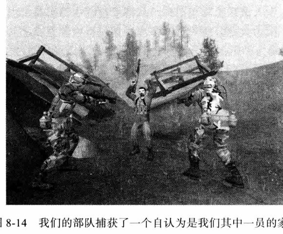

<!-- chapter-pager:start -->

<a class="chapter-pager__button chapter-pager__button--prev" href="../08-03-04-emotional-dimension">上一页</a>
<a class="chapter-pager__button chapter-pager__button--next" href="../../08-04-realism">下一页</a>

<!-- chapter-pager:end -->

# 8.3.5 道德维度

> 来源：私人资料库 OCR 整理，摘自《游戏设计基础（原书第 3 版）》第 8 章。PDF 为扫描版，文字已做轻度校正，仍建议以后逐段人工复核。  
> 关键词：物理维度、时间维度、环境维度、感情维度、道德维度

## 原书内容整理

游戏世界中的道德尺度定义了在某个背景下什么是对的，什么是错的。乍一看，这可能有点呆板——只是一个游戏而已，没必要谈道德。但是大部分有环境、有幻想成分的游136车游戏设计基础戏，都会有一个道德体系来限定玩家应该做些什么。作为设计者，你是游戏世界的主宰，应该建立好游戏中的道德观。当告诉玩家他必须做特定的操作来赢得胜利，你就把这些操作定义成好的或者可取的；相反地，当让玩家必须避免一些操作，这时你把这些操作定义成不好的或者不需要的。进入到这个世界的玩家必须适应你的标准，不然他们就会输掉游戏。在某些方面，游戏世界的道德观是文化和历史的一部分，之前把它划分在背景中已经讨论过了。但是由于它造成了特殊的设计难题，需要把它单独列出来讨论。很多游戏世界的道德准则有点背离现实世界——有时候甚至是完全相反的，游戏允许或者要求你做现实中不能做的事。游戏世界准许的动作范围通常比现实中的狭小（比如你可以随意驾驶你的F-15战斗机，却不能随意下飞机），但是这些允许的动作通常是很极端的：比如杀人、偷东西等。

#### 1. 道德决策

整体来说，大多数游戏都有明确的道德标准：打垮坏人，保护好人。这不是很深奥但是却很有用的标准，我们玩西洋象棋就是这样。很多游戏不会深度探索道德方面的内容。有的包括明确的道德选择，但不幸的是，这些游戏往往都很乏味，一直是奖励好的表现，惩罚不好的表现。这样说教的游戏小孩都会受不了，更不用说大人了。但是你可以设计一个更丰富、参与性更强的游戏，让玩家做一些艰难的抉择。道德的模棱两可和困难的决定是很多好游戏的核心，事实上很多时候也是生活的核心。你是否应该牺牲一个小分队去救一个士兵？如果你在这个小分队里你会作何感想？

#### 《美国陆军》独特的道德准则

《美国陆军》是一款基于团队的多玩家第一人称的射击游戏（first-person shooter，FPS），由美国军队免费发行，目的是作为一个教育和招募的工具，告诉玩家真正的士兵是怎样打仗的（如图8-14所示）

<figure class="book-figure">
  
  <figcaption>图8-14　我们的部队捕获了一个自认为是我们其中一员的家伙</figcaption>
</figure>

。它和其他的第一人称射击游戏有两个不同的地方。第一，它要求玩家要符合真正军队的训练要求，所以它检测并且惩罚不道德的行为。它要创造一种观念：当兵就一定要有严格的道德责任感。第二，也是一个很奇怪的方面，交战时每一方都把自己看成是美国士兵，把敌人看成是一般的恐怖分子。这个游戏不想给任何人向美国士兵开枪的机会，尽管很明显他们在互相射击。所以一个玩家把自己和队友看成是带着M-16步枪的美国士兵，但是他的对手把他们看成是带AK-47的恐怖分子。也就是说，每个人都把自己当成是好人，把对手当成是坏人，对于每个团队游戏都有两个不同版本。为了避免政治上产生令人不满意的设计（让玩家在美国军队制作的游戏里射击美国士兵），他们创造了一个道德等价物：谁对谁错只是一个纯粹的视角问题。《美国陆军》对不同的玩家显示不同游戏世界的技巧，在电子游戏界可以说是独一无二的。在很多角色扮演游戏里，你可以选择扮演坏人，任意地偷窃、杀人，但是其他角色会拒绝和你合作，甚至会一看见你就袭击你。抢劫比努力工作挣钱要容易，但是你会在其他方面为你的行为付出代价。“禁止不道德行为”这个规则在这种游戏里不适用，这里执行的规则是：“你可以做自由的道德选择，但是也要准备好承担后果。”玩家可以觉得怎么合适就怎么做，但是不管怎样做都有各目的优缺点。比起简单地惩罚不道德的行为，这是一个更成熟的解决问题的方法。要注意的是，现在仍有许多国家将游戏伦理的考量加进了电子游戏的评级系统中。如果你在游戏里允许做不道德的行为，它可能会得到一个评级，该级别可能表示它不适合对儿童开放。

#### 2. 关于游戏暴力的看法

本书的任务不是辩论，更不是为这个问题提供答案：暴力的电子游戏是否会在小孩或成人中间引发暴力行为。这是一个心理学问题，只有经过长时间认真的学习才能解决。不幸的是，关于这个问题很多人好像都已经打定了主意，争论也在政府部门和电视上继续上演，不过大部分都是没有事实依据的争论。然而，我们对设计者还是有些建议的。很多游戏的精华就是冲突，而冲突大多表现为暴力的现实程度。国际象棋是一个战争游戏，在里面棋子被杀掉——从棋盘上拿走一但是没人反对象棋的暴力，因为它是完全抽象的。足球是一个暴力的接触性运动，里面的人总是会受伤，但是也没人试图去禁止足球。从游戏过程中除去暴力的唯一方法就是禁止世界上的大多数游戏，因为大部分游戏都或多或少地包含抽象意义上的暴力。问题不是暴力本身，而是怎样描述暴力，还有在什么环境下的暴力是可以接受的。如果游戏跟现实世界看起来很像，但是道德尺度差别很大时，就会产生政治问题。游戏《惩罚者》鼓励玩家用撬棍把妓女打死，画面很真实很血腥。不出意料，它受到了很多批评。另一方面，《太空侵略者》里面要射击上百个外星人，因为它看起来很抽象，所以没人在意。换句话说，游戏跟现实越像，它的道德尺度也应该越类似于现实世界的道德尺度，不然它很可能会让人不高兴。如果你想让玩家在游戏里射击会动的东西，这些东西最好是非人类的，并且会消失而不是血淋淋地分裂成几块，这样才能让你远离麻烦。你需要在道德现实主义和视觉现实主义中找一个平衡点。计算机游戏正在把幻想带入生活中，让人们在虚幻世界里做一些现实中不能做的事情。但是对于那些分不清现实和幻想之间界限的人来说，带有虚幻世界的游戏是一个危险的游戏。小孩子（大概在8岁以下）对现实世界了解不多，他们不知道什么是可能的、什么是不可能的、什么是幻想、什么是现实。教育小孩的一个重要方面就是要教会他们分辨这些方面的不同。但是在他们学这些之前，最好要确保儿童游戏中的暴力都是和他们的年龄相符合的。暴力画面、写实的暴力行为，可能会惊吓到那些不经世事的小孩，因此最好不要让他们接触这些。关于小孩是怎样接触暴力的，如果你想要了解得更多、更深刻，可以读读杰拉德·琼斯的一篇文章：“杀死怪物：为什么小孩需要幻想、超级英雄和虚幻暴力。”最后，游戏世界的暴力要服务于游戏的玩家。否则，它就是没有必要的，应该考虑去除它。

<!-- chapter-pager:start -->

<a class="chapter-pager__button chapter-pager__button--prev" href="../08-03-04-emotional-dimension">上一页</a>
<a class="chapter-pager__button chapter-pager__button--next" href="../../08-04-realism">下一页</a>

<!-- chapter-pager:end -->

## 我的批注区

-
