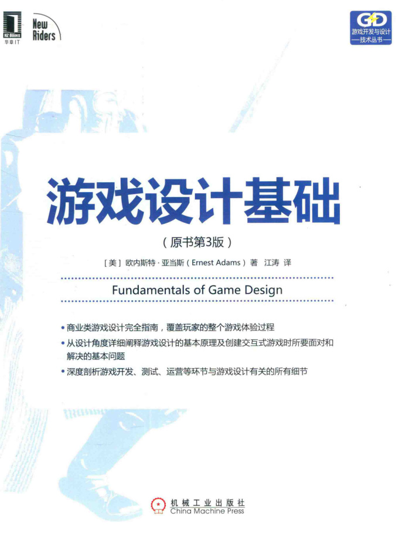

<section class="book-home">
  
Personal Reading Vault

  <h1>书籍笔记</h1>
  
按书籍整理的在线知识库。每本书独立成册，进入后可按章节目录阅读笔记、摘要与概念卡片。

  

    <a class="book-card" href="01-游戏和电子游戏/">
      
      

        <h2 class="book-card__title">游戏设计基础（原书第3版）</h2>
        
已建立目录

        
游戏设计、玩家、机制、平衡、关卡与在线游戏设计的系统化读书笔记。

      

    </a>

    

      
＋

      

        <h2 class="book-card__title">新书阅读中</h2>
        
占位

        
下一本书的知识库入口会放在这里。

      

    

  

</section>
